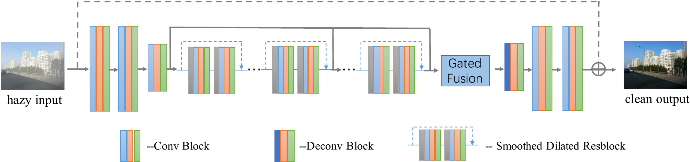
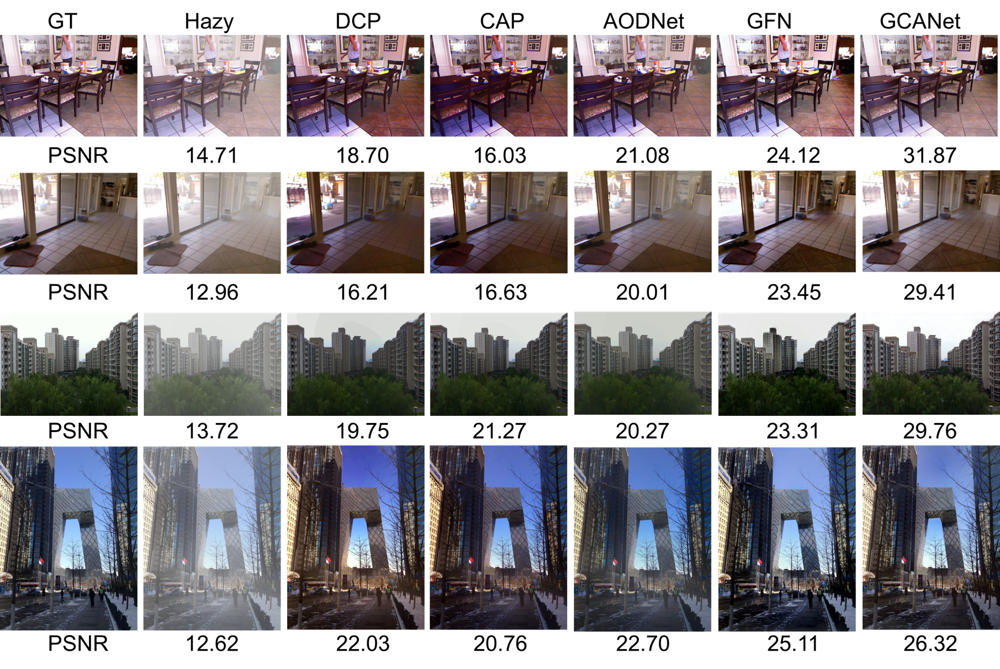
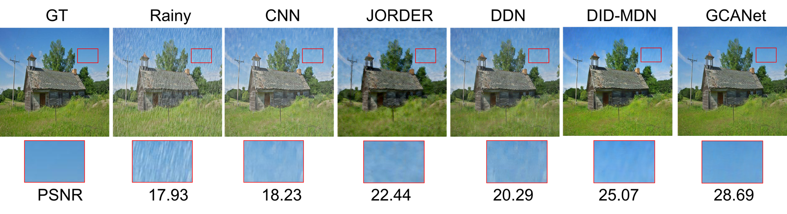

Gated Context Aggregation Network for Image Dehazing and Deraining
=======


This is the implementation of our WACV 2019 paper *"Gated Context Aggregation Network for Image Dehazing and Deraining"* by [Dongdong Chen](<http://www.dongdongchen.bid/>), [Mingming He](<https://github.com/hmmlillian>), [Qingnan Fan](<https://fqnchina.github.io/>), *et al.*

In this paper, we propose a new end-to-end gated context aggregation network GCANet for image dehazing, in which the smoothed dilated convolution is used to avoid the gridding artifacts and a gated subnetwork is applied to fuse the features of different levels. Experiments show that GCANet can obtain much better performance than all the previous state-of-the-art image dehazing methods both qualitatively and quantitatively


We further apply our proposed GCANet to the image deraining task, which also outperforms previous state-of-the-art image deraining methods and demonstrates its generality.



## Getting Started

This paper is implemented with Pytorch framework.

Demo
----

Directly put all your test images under one directory. Then run:

```bash
python test.py --task [dehaze | derain] --gpu_id [gpu_id] --indir [input directory] --outdir [output directory]
```

For training, please download the training code from <https://drive.google.com/file/d/1T7X1HYztbz6S75vTRNtREgGEOI269KDk/view?usp=sharing>

Cite
----

You can use our codes for research purpose only. And please cite our paper when you use our codes.
```
@article{chen2018gated,
  title={Gated Context Aggregation Network for Image Dehazing and Deraining},
  author={Chen, Dongdong and He, Mingming and Fan, Qingnan and Liao, Jing and Zhang, Liheng and Hou, Dongdong and Yuan, Lu and Hua, Gang},
  journal={WACV 2019},
  year={2018}
}
```
Contact
-------

If you find any bugs or have any ideas of optimizing these codes, please contact me via cddlyf [at] gmail [dot] com


